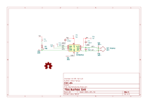
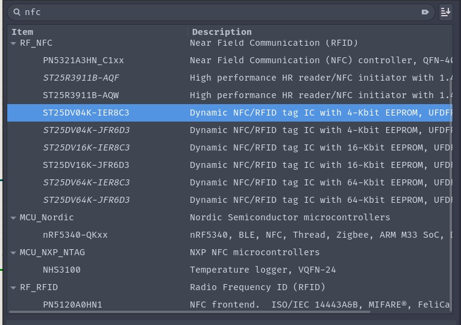
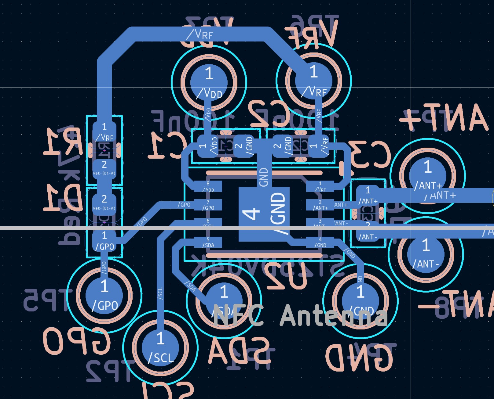
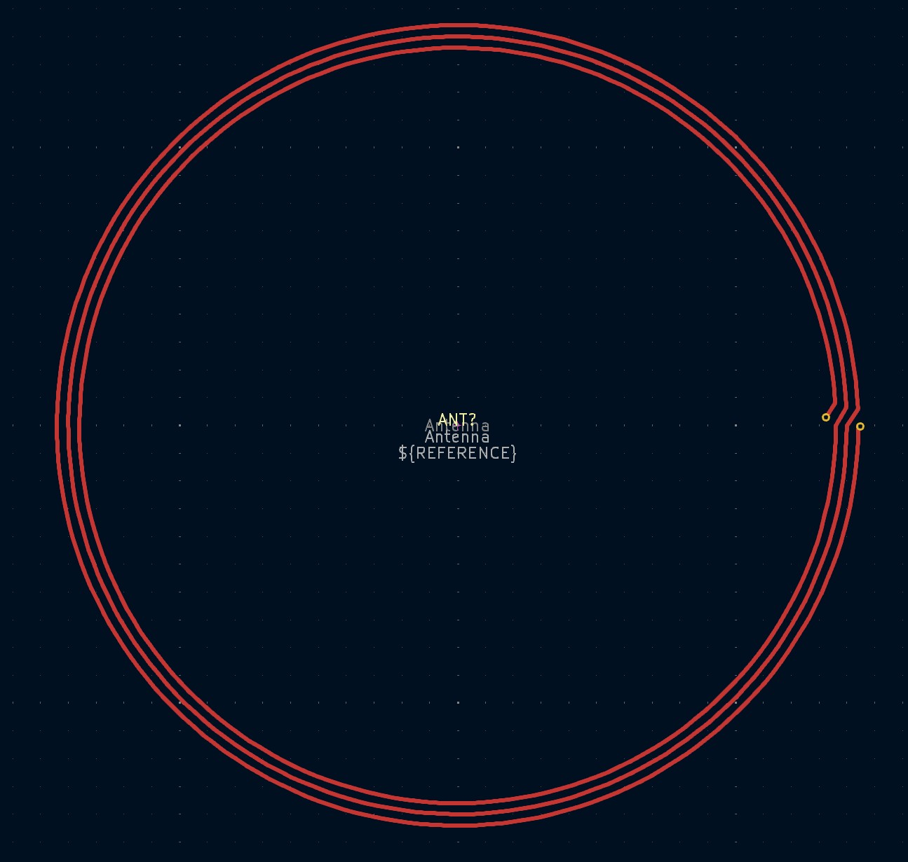
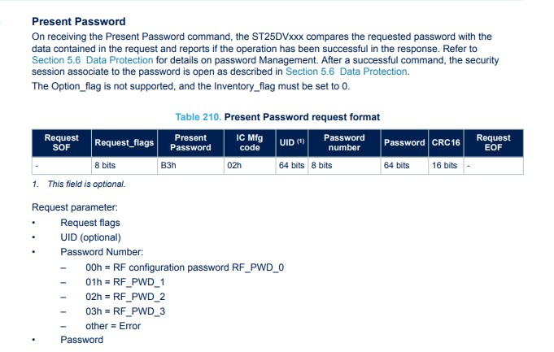
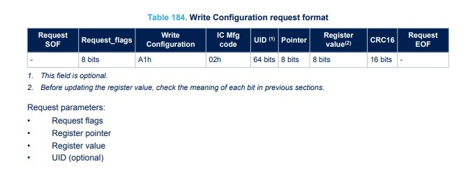
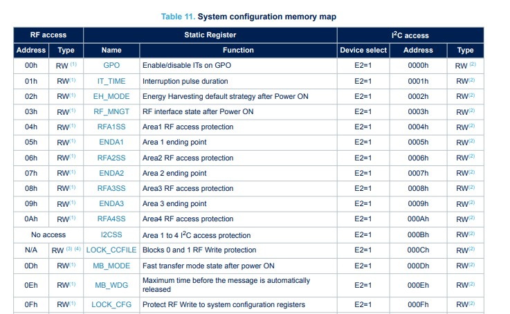
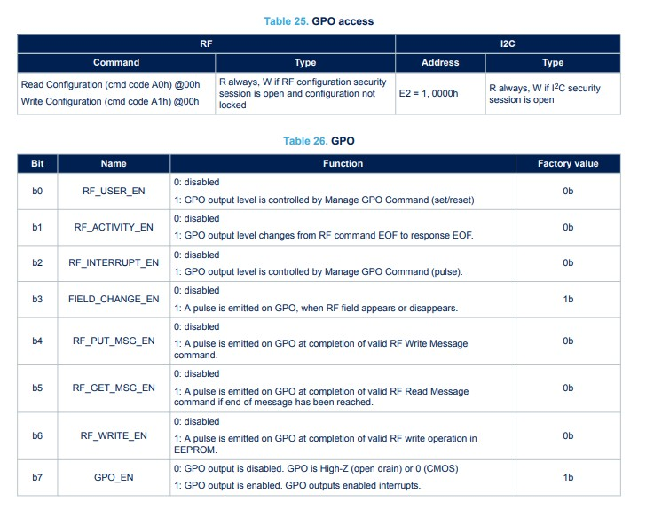
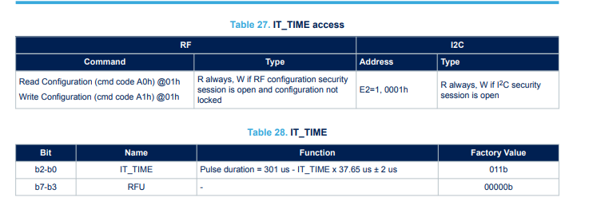
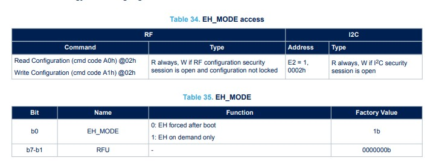

# Crab Labs Business Card Specification

The Crab Labs Business card utilizes a NFC system as well as a QR code on a PCB to communicate contact information to people

The QR code was added to the Crab Labs logo using [Inkscape](https://inkscape.org/) using the object difference tool. The QR code was generated with [QR Code Monkey](https://www.qrcode-monkey.com/), it leads to the [Crab Labs Website](https://crablabs.io)

The NFC tag utilizes the ISO 15693 enabled IC, the ST25DV04K, which has 4 kilobytes of programmable memory which holds the contact information for Crab Labs engineers.

## Schematic

The schematic for the device is as follows:

### NFC Transponder

The device centers around the NFC transponder IC by ST Microelectronics, the [ST25DV04k](https://www.st.com/en/nfc/st25dv04k.html). This component was chosen because of its presence in the KiCad standard library.

Along with existing in the KiCad standard library, the device is also available on [LCSC](https://www.lcsc.com/) in large quantities. This means that it will be able for assembly through JLCPCB, the chosen manufacturer for this part.

This part was found by searching the KiCad standard library for NFC components through the symbol adding menu as shown here.

### NFC Transponder Footprint

The exact version of the component is changed to reflect what is available on LCSC, this means the footprint is UFDFN-8-EP, which is very similar to a DFN. There were other packages available in the same series, including wafer level packaging. This package was chosen to minimize size and height while still being easily hand-solderable.

### Antenna Circuitry

NFC antennas are always loop antennas, and thus the antenna symbol chosen is the loop antenna symbol. There is a matching capacitor which increases the efficiency and signal to noise ratio of the NFC signal.

The matching network is calculated by finding the antenna inductance using [this](https://www.st.com/resource/en/application_note/cd00221490-how-to-design-a-1356-mhz-customized-antenna-for-st25-nfc--rfid-tags-stmicroelectronics.pdf) application note by ST. The antenna capacitance is usually not significant and can be ignored, the antenna resistance should be reduced as much as possible. A rough estimate of the parasitics was calculated using the [NXP NFC antenna tools](https://community.nxp.com/t5/NFC/bd-p/nfc).

### Supporting Circuity

The remaining circuitry is relatively simple.

There are test points (marked TP*) on all nets that can be seen on the PCB, these are used for validating and testing the device.

There are several power supply capacitors on the optional input supply (VDD) as well as the energy harvesting supply (VRF). The VDD supply is an optional power supply that is powered if you would like to communicate via I2C to the device. If that supply is not powered then the device depends on power received from the the host device trying to interact with it via [inductive coupling](https://en.wikipedia.org/wiki/Inductive_coupling).

There is a status LED that is powered from the captured electromagnetic energy, it is turned on and off by the transceiver via the GPO pin which can be programmed via NFC or I2C interface to turn on and off under certain conditions, by default the GPO pin remains floating.

## Circuit Layout

The layout is as follows:

Front Side Copper:

Back Side Copper:

Front Side Silkscreen:

Backside Silkscreen:

### NFC Tag Layout

The NFC Tag is laid out as seen here:

There is no ground pour as any large copper areas would interfere with the antenna characteristics and thus effect the NFC communication.

All of the passive components are 0402 to reduce the height of the circuit while still being hand-solderable to some extent.

The antenna traces are carefully routed to not introduce extra parasitics.

### NFC Antenna Footprint

The NFC antenna is a special footprint that is created with the following specifications:

- Trace width: .4 mm
- Trace spacing: .6mm
- Outer radius: 72mm
- Number of Turns: 3

This is the completed footprint

The antenna was carefully calculated using several different sources to find the proper parameters. It has been tested and proven to work up to several centimeters.

## Device Programming

The device is programmed to turn the status on and off when there is a new device detected, when there is a read operation, and when there is a write operation.

The device configuration can be written over I2C or NFC, Crab Labs sets the configuration via NFC.

Crab Labs used the [NFC Tools Pro](https://play.google.com/store/apps/details?id=com.wakdev.nfctools.pro&hl=en_US&pli=1) application on Android for this but any system which can write arbitrary NFC commands will work

In order to program the configuration the device must be unlocked with a key, Crab Labs uses the default key value of 0.

The datasheet specifies the format for unlocking the core configuration registers (page 123):

A successful password entry command would be: __02:B3:02:00:00:00:00:00:00:00:00:00__ over NFC where request flags are for the current device (02), the command is present password (B3), the password number is 0 (for the configuration password) and the password is 64 bits of 0

Once the password has been input then the core registers can be written, in this case we will want to write to the configuration: the command is shown here (Page 113):

The configuration registers are shown here (page 17):

Crab Labs set the configuration registers to the following values with the following commands:

Set the GPO Pin to pull down on all possible interrupt cases: __02:A1:02:00:FA__, this turns on the status LED as much as possible

Set the Interrupt time to max: __02:A1:02:01:00__. This is done so that the status LED can be seen as long as possible

Enable Energy Harvesting: __02:A1:02:02:00__. This enables the status LED to have power

With all of these registers programmed the device will light up when you approach it and blink when a device is kept near it.
